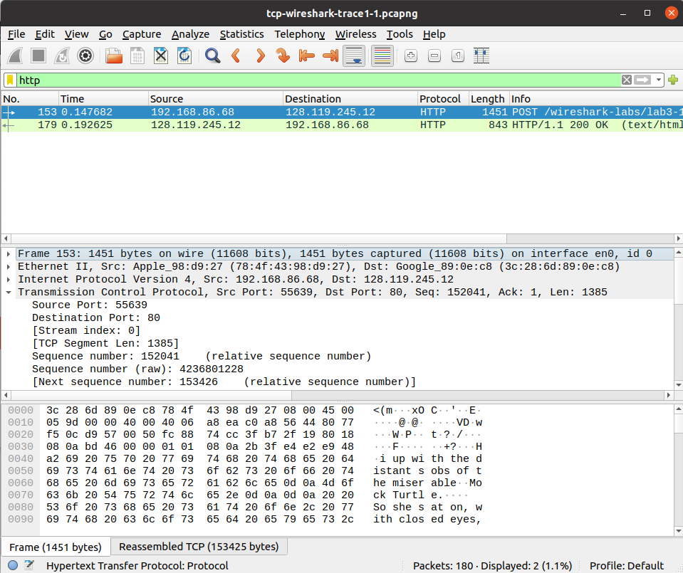
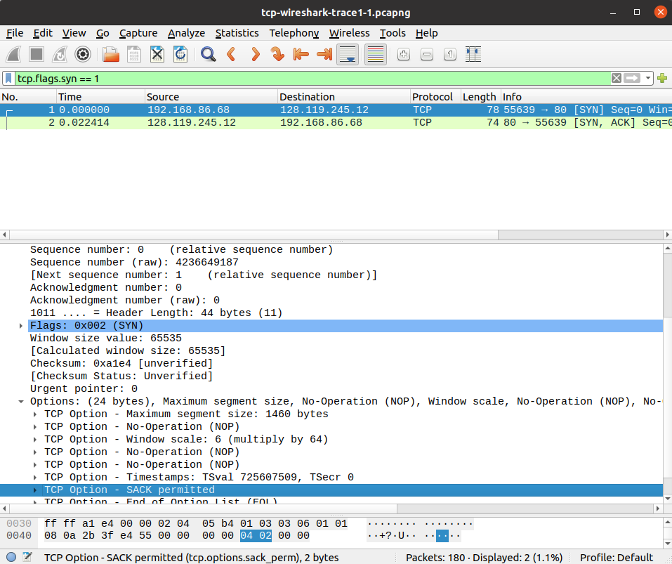
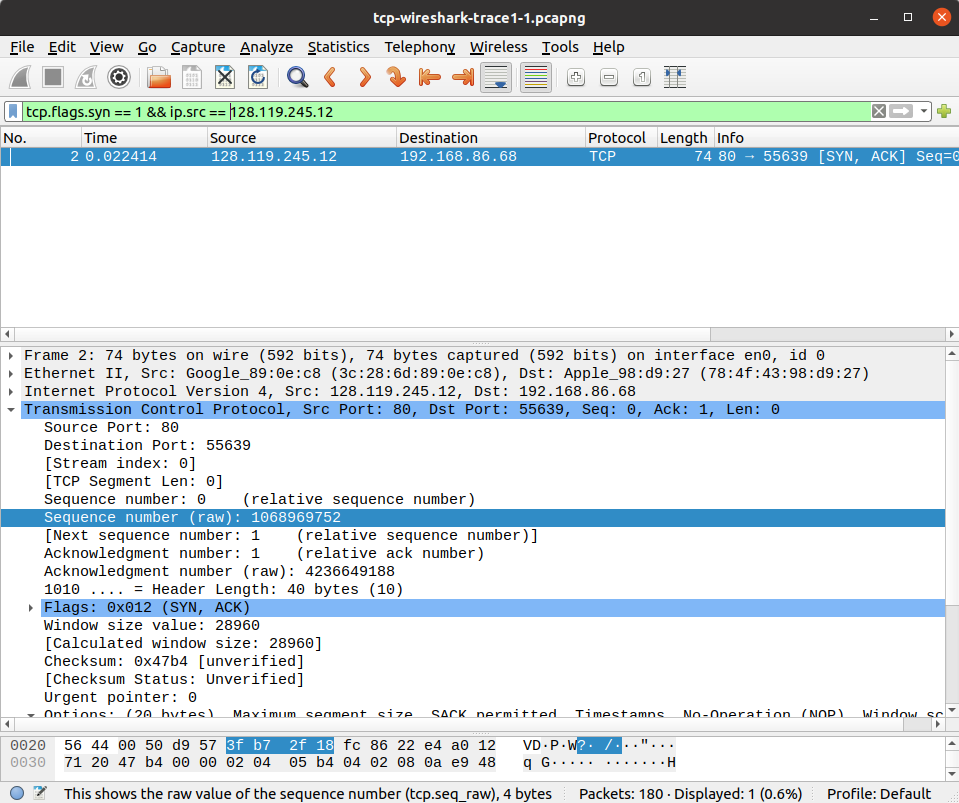

# TCP-UCP

<h3>Nama : Arundaya Pratama Nurhasan
 
NRP  : 5025221206</h3>

## TCP
### No.1

What is the IP address and TCP port number used by the client computer (source) that is transferring the alice.txt file to gaia.cs.umass.edu?

Setelah melakukan filter ``http`` maka akan terlihat bahwa alamat IP dari ``source`` adalah ``192.168.86.68`` dan port TCP yang digunakan adalah ``55639``

### No.2

What is the IP address of gaia.cs.umass.edu? On what port number is it sending and receiving TCP segments for this connection?

Berdasarkan gambar diatas dapat kita lihat bahwa alamat IP dari gaia.cs.umass.edu adalah ``128.119.245.12`` dan menggunakan port ``80``

### No.3

What is the sequence number of the TCP SYN segment that is used to initiate the TCP connection between the client computer and gaia.cs.umass.edu? What is it in this TCP segment that identifies the segment as a SYN segment? Will the TCP receiver in this session be able to use Selective Acknowledgments?

Setelah diseleksi dengan filter ``tcp.flags.syn == 1`` maka akan terlihat bahwa Sequence number (raw) dari client computer ke gaia.cs.umass.edu adalah ``4236649187``, segemen TCP tersebut bisa dipastikan sebagai segmen SYN dengan melihat ``Flags: 0x002 (SYN)`` dan bisa menggunakan Selective Acknowledgments yang terlihat dari bagian option yaitu ``SACK permitted``

### No.4

What is the sequence number of the SYNACK segment sent by gaia.cs.umass.edu to the client computer in reply to the SYN? What is it in the segment that identifies the segment as a SYNACK segment? What is the value of the Acknowledgement field in the SYNACK segment? How did gaia.cs.umass.edu determine that value?

 
Setelah melakukan seleksi dengan filter ``tcp.flags.syn == 1 && ip.src == 128.119.245.12`` (karena pesan berasal dari gaia.cs.umass.edu) maka akan terlihat bahwa Sequence number (raw) dari gaia.cs.umass.edu ke client computer adalah ``1068969752``, segemen TCP tersebut bisa dipastikan sebagai segmen SYNACK dengan melihat ``Flags: 0x012 (SYNACK)`` dan memiliki Acknowledgments Number (raw) yaitu ``4236649188``

