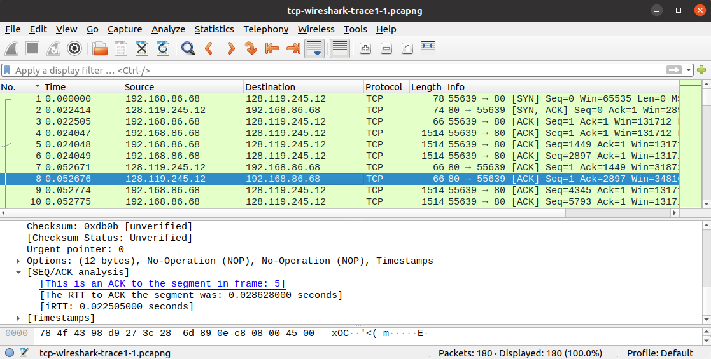

# TCP-UCP

#### Nama : Arundaya Pratama Nurhasan
#### NRP  : 5025221206

## TCP
### No.1
What is the IP address and TCP port number used by the client computer (source) that is transferring the alice.txt file to gaia.cs.umass.edu?

Setelah melakukan filter `http` maka akan terlihat bahwa alamat IP dari `source` adalah `192.168.86.68` dan port TCP yang digunakan adalah `55639`

### No.2
What is the IP address of gaia.cs.umass.edu? On what port number is it sending and receiving TCP segments for this connection?

Berdasarkan gambar pada  nomor satu dapat kita lihat bahwa alamat IP dari gaia.cs.umass.edu adalah `128.119.245.12` dan menggunakan port `80`

### No.3
What is the sequence number of the TCP SYN segment that is used to initiate the TCP connection between the client computer and gaia.cs.umass.edu? What is it in this TCP segment that identifies the segment as a SYN segment? Will the TCP receiver in this session be able to use Selective Acknowledgments?

Setelah diseleksi dengan filter `tcp.flags.syn == 1` maka akan terlihat bahwa Sequence number (raw) dari client computer ke gaia.cs.umass.edu adalah `4236649187`, segemen TCP tersebut bisa dipastikan sebagai segmen SYN dengan melihat `Flags: 0x002 (SYN)` dan bisa menggunakan Selective Acknowledgments yang terlihat dari bagian option yaitu `SACK permitted`

### No.4
What is the sequence number of the SYNACK segment sent by gaia.cs.umass.edu to the client computer in reply to the SYN? What is it in the segment that identifies the segment as a SYNACK segment What is the value of the Acknowledgement field in the SYNACK segment? How did gaia.cs.umass.edu determine that value?

Setelah melakukan seleksi dengan filter `tcp.flags.syn == 1 && ip.src == 128.119.245.12` (karena pesan berasal dari gaia.cs.umass.edu) maka akan terlihat bahwa Sequence number (raw) dari gaia.cs.umass.edu ke client computer adalah `1068969752`, segemen TCP tersebut bisa dipastikan sebagai segmen SYNACK dengan melihat `Flags: 0x012 (SYNACK)` dan memiliki Acknowledgments Number (raw) yaitu `4236649188`

### No.5
What is the sequence number of the TCP segment containing the header of the HTTP POST command? How many bytes of data are contained in the payload (data) field of this TCP segment? Did all of the data in the transferred file alice.txt fit into this single segment?

Dengan melakukan filter `http.request.method == POST` seperti gambar diatas kita akan mendapati bahwa Sequence Number segmen tersebut adalah 152041 dengan Sequence Number (raw) adalah 4236801228 dan TCP Payload sebesar 1385 bytes. Dari data tersebut juga terlihat bahwa file tersebut tidak dikirim hanya menggunakan satu segmen saja melainkan menggunakan `MIME` (Multipart Media Encapsulation)

### No.6
Consider the TCP segment containing the HTTP “POST” as the first segment in the data transfer part of the TCP connection.
At what time was the first segment (the one containing the HTTP POST) in the data-transfer part of the TCP connection sent? At what time was the ACK for this first data-containing segment received? What is the RTT for this first data-containing segment? What is the RTT value the second data-carrying TCP segment and its ACK? What is the EstimatedRTT value (see Section 3.5.3, in the text) after the ACK for the second data-carrying segment is received?

Berdasarkan gambar diatas dapat dilihat bahwa pengiriman segemen data pertama kali terjadi pada `Frame: 4` 

Terlihat pada gambar diatas bahwa `Frame: 4` terjadi pada detik ke-`0.24047`

Kemudian terlihat juga pada `Frame: 7` ACK dari segmen data pertama akan diterima yaitu pada detik ke-`0.052671`

Berdasarkan gambar diatas dapat disimpulkan bahwa RTT dari data pertama adalah 0.028624 detik

Didapat dari gambar bahwa segmen data kedua dimulai dari `Frame: 5` dan ACK dari segmen tersebut akan diterima pada `Frame: 8` yang memiliki nilai RTT 0.028628 detik

### No.7
What is the length (header plus payload) of each of the first four data-carrying TCP segments?

Dari gambar diatas dapat dilihat bahwa panjang dari 4 segmen pertama adalah 4*(1448+32) = 5920 bytes

## UDP
### No.1
Select the first UDP segment in your trace. What is the packet number4 of this segment in the trace file? What type of application-layer payload or protocol message is being carried in this UDP segment? Look at the details of this packet in Wireshark. How many fields there are in the UDP header? What are the names of these fields?

Berdasarkan gambar diatas kita dapat nomor paket adalah 5 dengan protokol `SSDP` dan memiliki 4 fields yaitu `source port`, `destination port`, `length`, dan `checksum`

### No.2
By consulting the displayed information in Wireshark’s packet content field for this packet (or by consulting the textbook), what is the length (in bytes) of each of the UDP header fields?

Dari gambar di soal 1 setiap field memiliki 2 bytes, karena ada 4 fields maka totalnya adalah 4*2 = 8 bytes

### No.3
The value in the Length field is the length of what?

Karena Length field adalah gabungan UDP header dan UDP payload. Berdasarkan gambar diatas UDP payload = 275 dengan Header = 8, maka Length fieldnya adalah 275+8 = 283
  
### No.4
What is the maximum number of bytes that can be included in a UDP payload?

Jumlh maximum bytes yang dapat dimasukkan ke dalam UDP payload adalah (2^16-1) bytes (termasuk header bytes). Sehingga, maximum bytes yang dapat dimasukkan ke dalam UDP payload adalah (2^16-1)-8 = 65527 bytes

### No.5
What is the largest possible source port number?

source port terbesar yang mungkin adalah (2^16-1) = 65535

### No.6

img

What is the protocol number for UDP? Give your answer in decimal notation.

Berdasarkan gambar diatas dapat dilihat bahwa nomor protokol untuk UDP adalah `17` atau `0x11`

### No.7
Examine the pair of UDP packets in which your host sends the first UDP packet and the second UDP packet is a reply to this first UDP packet. (Hint: for a second packet to be sent in response to a first packet, the sender of the first packet should be the destination of the second packet). What is the packet number of the first of these two UDP segments in the trace file? What is the packet number6 of the second of these two UDP segments in the trace file? Describe the relationship between the port numbers in the two packets.

img

Berdasarkan gambar nomor paket pertama dari dua UDP segmen dalah `paket 15`, kemudian nomor paket ke 2 dari dua UDP segmen adalah `Paket 17`

kita dapat menyimpulkam bahwa hubungan antara nomor-nomor packet adalah source port dari paket 15 (request) adalah destinasi port untuk paket 17 (reply) dan sebaliknya

